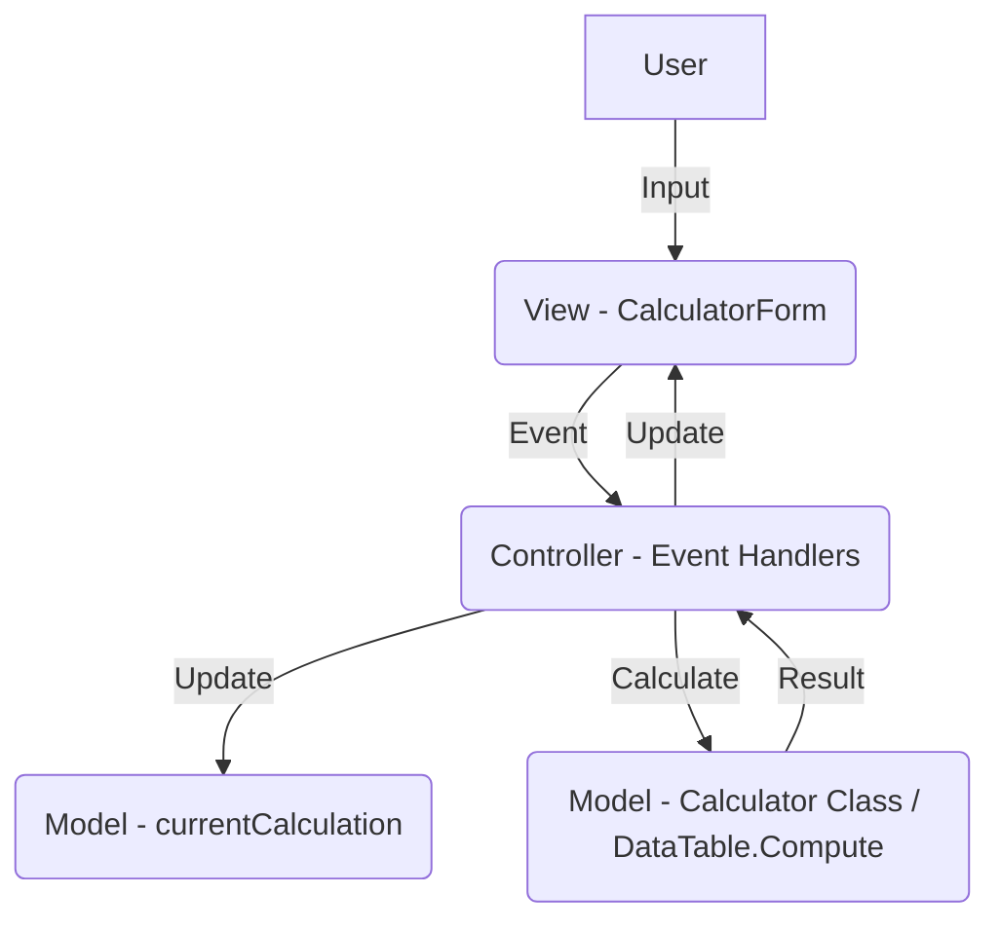

# Numlock_Calc - Complete Technical Documentation

## 1. Executive Summary
Numlock_Calc is a C# Windows Forms desktop application that provides standard and scientific calculator functionality. Its key feature is its integration with the NumLock key, which acts as a global hotkey to show or hide the calculator window. The application also enforces that the NumLock key remains active, ensuring the numeric keypad is always available for input. It supports basic arithmetic, unary operations (square root, square, logarithm), and maintains a history of calculations. The application can be minimized to the system tray for unobtrusive operation.

## 2. Architecture Overview
The application follows a simple, monolithic architecture, which is common for small Windows Forms applications. It can be described as a variation of the Model-View-Controller (MVC) pattern, where:

*   **Model**: The `Calculator` class and the `DataTable.Compute` method represent the model. They encapsulate the mathematical logic and the state of the calculations. The `currentCalculation` string in `CalculatorForm` also acts as part of the model.
*   **View**: The `CalculatorForm` and its components (buttons, text box, etc.) defined in `CalculatorForm.Designer.cs` constitute the view. They are responsible for displaying the user interface.
*   **Controller**: The event handlers within the `CalculatorForm` class act as the controller. They respond to user input (button clicks, key presses), update the model (`currentCalculation`), and refresh the view (`displayTextBox`).

Data flow is straightforward:
1.  User interacts with the View (e.g., clicks a button).
2.  The Controller (event handler) in `CalculatorForm` captures the input.
3.  The Controller updates the Model (`currentCalculation` string).
4.  For complex calculations, the Controller calls the `Calculator` class or `DataTable.Compute`.
5.  The result is returned to the Controller.
6.  The Controller updates the View (`displayTextBox`) with the result.

## 3. Component Inventory
*   `Program.cs`: The main entry point of the application.
*   `CalculatorForm.cs`: The main form of the calculator, containing the UI logic, event handlers, and system integration (hotkeys, tray icon).
*   `CalculatorForm.Designer.cs`: Auto-generated code for the UI layout and components.
*   `Calculator.cs`: A static class containing the core mathematical functions.
*   `Numlock_Calc.csproj`: The project file, defining project settings and dependencies.

## 4. Detailed Component Documentation
### 4.1 Program.cs
*   **Purpose**: To initialize and run the Windows Forms application.
*   **Public Interface**: `static void Main()`
*   **Dependencies**: `CalculatorForm`
*   **Implementation Details**: It calls `ApplicationConfiguration.Initialize()` and `Application.Run(new CalculatorForm())`.

### 4.2 CalculatorForm.cs
*   **Purpose**: To provide the main user interface for the calculator and handle all user interactions. It also manages the application's lifecycle, including tray icon and hotkey integration.
*   **Public Interface**:
    *   `CalculatorForm()`: Constructor.
    *   `PreFilterMessage(ref Message m)`: Filters incoming messages to handle the global hotkey.
*   **Dependencies**: `Calculator.cs`, `System.Windows.Forms`, `System.Data`
*   **Implementation Details**:
    *   **State Management**:
        *   `currentCalculation` (string): Stores the current expression being built.
        *   `isNewCalculation` (bool): A flag to determine if the next input should start a new calculation.
    *   **Event Handlers**: Contains `Click` event handlers for all buttons and a `KeyDown` event handler for keyboard input.
    *   **Calculation**: Uses `DataTable.Compute()` to evaluate the final expression. For unary operations, it calls methods from the `Calculator` class.
    *   **System Integration**:
        *   Uses P/Invoke (`DllImport`) to register a global hotkey for the `VK_NUMLOCK` key.
        *   Manages a system tray icon for minimizing and restoring the application.
        *   Enforces that the NumLock key is always on using a timer.
*   **Key Algorithms**:
    *   **Expression Building**: Appends numbers and operators to the `currentCalculation` string.
    *   **Evaluation**: The `EqualsClick` method uses `new DataTable().Compute(expression, null)` to evaluate the expression. The `^` operator is replaced with `**` to be compatible with `DataTable.Compute`.
    *   **Unary Operations**: The `UnaryOperatorClick` method parses the last number in the expression, applies the unary function from the `Calculator` class, and replaces the number with the result.

### 4.3 Calculator.cs
*   **Purpose**: To provide a set of static methods for performing mathematical calculations.
*   **Public Interface**:
    *   `static double Add(double a, double b)`
    *   `static double Subtract(double a, double b)`
    *   `static double Multiply(double a, double b)`
    *   `static double Divide(double a, double b)`
    *   `static double SquareRoot(double a)`
    *   `static double Square(double a)`
    *   `static double Power(double @base, double exponent)`
    *   `static double Log(double a, double baseLog = 10)`
*   **Dependencies**: None
*   **Implementation Details**: A static class with static methods that wrap `System.Math` functions and provide basic arithmetic. It includes error handling for invalid operations like division by zero or taking the square root of a negative number.

## 5. Data Models
The application does not have any complex data models. The primary data structure is the `currentCalculation` string, which represents the mathematical expression being constructed.

## 6. Business Logic Specifications
*   **Calculation Order**: The order of operations is determined by the `DataTable.Compute` method, which follows standard mathematical rules (PEMDAS/BODMAS).
*   **Unary Operations**: Unary operations are applied immediately to the last number entered.
*   **Error Handling**:
    *   Division by zero is prevented in the `Calculator.Divide` method and will also cause an error in `DataTable.Compute`.
    *   Taking the square root of a negative number is prevented.
    *   Taking the logarithm of a non-positive number is prevented.
    *   Any invalid expression passed to `DataTable.Compute` will result in an exception, which is caught and displayed to the user in a `MessageBox`.
*   **State Management**:
    *   `isNewCalculation` flag is used to clear the previous result when a new calculation is started.
    *   The `C` button clears the entire expression, while `CE` clears the last entry.

## 7. API Specifications
Not applicable, as this is a desktop application with no external API.

## 8. Configuration Guide
There are no external configuration files or settings.

## 9. Data Access Specifications
Not applicable, as the application does not interact with a database.

## 10. Cross-Cutting Concerns
### Error Handling
*   Exceptions are handled at the point of calculation (`EqualsClick`, `UnaryOperatorClick`) and displayed to the user via a `MessageBox`. The calculator state is then cleared.
### Logging
*   There is no logging mechanism in the application.
### Security
*   The use of `DataTable.Compute` can be a security risk if the input is not properly sanitized, as it can be used to execute arbitrary code. In this application, the input is constrained to numbers and operators, which mitigates the risk.
*   The application uses P/Invoke to call native Windows API functions, which requires a certain level of trust.

## 11. Integration Specifications
*   **Operating System**: The application integrates with the Windows operating system through:
    *   **Global Hotkeys**: Using `RegisterHotKey` to listen for `NumLock` key presses system-wide.
    *   **System Tray**: Using `NotifyIcon` to place an icon in the system tray.
    *   **Keyboard Input**: Simulating key presses using `keybd_event` to keep NumLock on.

## 12. Implementation Notes
*   **Calculation Engine**: The core calculation logic relies on the `System.Data.DataTable.Compute` method. A reimplementation would need to find an equivalent library for parsing and evaluating mathematical expressions.
*   **UI Framework**: The application is built on Windows Forms. A reimplementation would require a UI framework for the target platform.
*   **System Integration**: The hotkey and system tray functionality is specific to the Windows operating system. A reimplementation on a different platform would need to use platform-specific APIs to achieve the same functionality.

## 13. Reimplementation Checklist
- [ ] Choose a target programming language and UI framework.
- [ ] Implement the basic calculator UI with number pads, operator buttons, and a display.
- [ ] Implement the logic for building the calculation string.
- [ ] Find a library or implement a function for evaluating mathematical expressions (equivalent to `DataTable.Compute`).
- [ ] Implement the unary operations (Square Root, Square, Log).
- [ ] Implement the history feature.
- [ ] Implement the `C`, `CE`, `Backspace`, and `Negate` functions.
- [ ] Implement platform-specific global hotkey functionality.
- [ ] Implement platform-specific system tray/notification area integration.
- [ ] Replicate the behavior of enforcing NumLock to be on, if applicable to the target platform.
- [ ] Test all calculator functions and edge cases.
